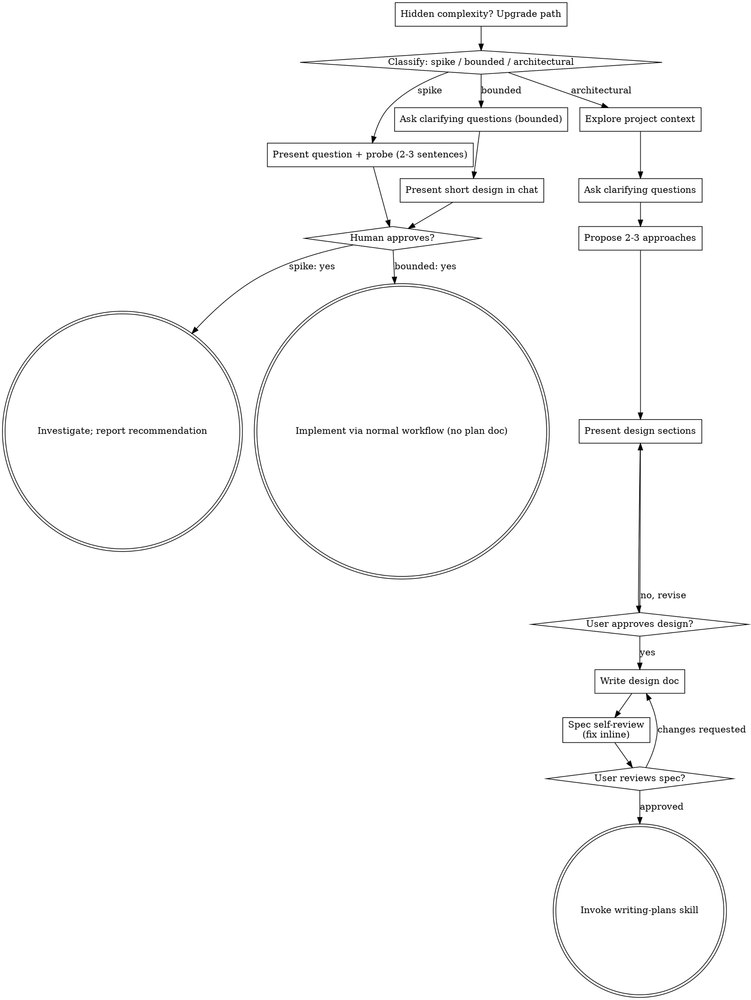

# Brainstorming Ideas Into Designs

Help turn ideas into fully formed designs and specs through natural collaborative dialogue.

Start by classifying how much process the request needs, then work
through your path: understand the context, refine the idea, present a
design, and get your human partner's approval.

<HARD-GATE>
Do NOT invoke any implementation skill, write any code, scaffold any
project, or take any implementation action until you have told your
human partner what you intend and they have approved it. This applies
to EVERY task on EVERY path below — the ceremony scales with the task;
the approval gate never does.
</HARD-GATE>

## Three Paths

Before your first question, classify the request and say the
classification out loud — "this looks bounded, so I'll present a short
design here rather than write a spec" — so your human partner can
override it:

- **Spike** — a feasibility question ("can we...", "is it possible...",
  "quick and dirty is fine") whose output is an answer, not code you
  keep. Present the question and what you'll try in 2-3 sentences, get
  a nod, then find out as cheaply as correctness allows. No design
  doc, no spec file. Report findings as a recommendation; anything you
  built stays labeled throwaway.
- **Bounded** — a well-scoped change to code that already exists in
  this repo: a new flag, a small endpoint, a one-file fix.
  Understanding the kind of app is not enough — bounded means the flow
  you are changing is already here to read. If there is no existing
  flow to change, the task is not bounded. Ask the clarifying
  questions that matter, present a short design IN CHAT (a few
  sentences to a few short paragraphs), and STOP. Implementation
  starts only after your human partner says yes to that design — a
  bounded task's approval is as hard a gate as an architectural
  one. No spec file, no implementation plan document.
- **Architectural** — new projects, new subsystems, changes that
  restructure how components fit together or alter interfaces others
  depend on. Follow the full process: questions, approaches, sectioned
  design, written spec, then the writing-plans skill.

When in doubt between two paths, take the heavier one. The ratchet is
one-way: hidden complexity discovered mid-task upgrades the path —
stop, say so, and step up. Nothing downgrades mid-task.

## Anti-Pattern: "Too Simple To Need Approval"

Every path ends with your human partner approving your intent before
implementation. A todo list, a single-function utility, a config
change — the design may be two sentences in chat, but you MUST present
it and get approval. "Simple" tasks are where unexamined assumptions
cause the most wasted work. What scales with simplicity is the
artifact, never the approval.

## Red Flags

| Thought | Reality |
|---------|---------|
| "This is too simple to need a design" | Simple means a short design, not no design. Two sentences in chat, then approval. |
| "I'll call it bounded and skip the spec" | Reaching for a label to skip work IS the doubt — take the heavier path. |
| "It's bounded and the design is obvious — I'll start while they read it" | The gate is the approval, not the design's length. Present, then stop until you hear yes. |
| "I understand this kind of app, so it's bounded" | Bounded measures the repo, not your familiarity. A new project has no existing flow — it is architectural. |
| "The spike works, so I'll keep the code" | A spike's output is an answer. Keeping the code is a new request — classify it. |
| "It grew, but I'm almost done — no need to re-classify" | Hidden complexity upgrades the path mid-task. Stop and say so. |
| "They approved the spike, so the follow-up change is approved too" | Each task gets its own classification and its own approval. |

## Epic-mode note (kind: Epic)

At design time, design the owning Epic itself. Its design artifact may include a
thin index of anticipated children (title, type, summary, affects, and dependency
rationale), but do not file children or pre-write child design artifacts here.
`planning-epics` files children during the plan stage, records the canonical
`path` returned for each, and writes the dependency graph. This keeps every
child design at its owned `<child-path>/references/01-design.md` location and
avoids a pathless draft/adoption phase.

Record settled decisions against the canonical owner path:

```bash
gw work decision add <work-path> --question "..." --status answered \
  --answer "..." --rationale "..."
```

## Auto-file Mode (standalone invocations)

Brainstorming runs in two contexts. **Step 0 below decides which, before anything else.** When dispatched as the `design` stage of the work pipeline, a work item already exists — behave exactly as today. When invoked standalone, auto-file a work item so the design enters the tracked pipeline instead of leaking outside it.

### Step 0 — Mode check (run FIRST, before "Explore project context")

Decide the mode purely from your dispatch brief — a doc check, no new tooling:

- **A work item already exists** when the brief contains a work-item brief (a title / kind / summary block) **or** the line *"STOP after writing the spec — do not invoke writing-plans."* These are the canonical "work item exists" signals the `graph-works:workflow` skill prepends when it dispatches the `design` stage.
  → **Skip auto-file entirely.** Run the legacy flow (Checklist steps 1-9) unchanged. Do **not** file a work item. Ignore the rest of this section.
- **Standalone** when neither signal is present.
  → **Enter auto-file mode:** perform Steps 2a, 3a, and 4a below in addition to the normal flow.

### Step 2a — Early stub + one quick confirm (auto-file mode only)

After "Explore project context" (Checklist step 1) and before asking clarifying questions, derive a proposed **title / type / summary / stable name / affects / effort** from the opening request and present them in a single confirm:

> "I'll track this as a work item — **title** / **type** / **summary** / name: **stable words** / affects / effort. Good, or adjust? (or say 'don't file')"

This one confirm does two things:

- **Locks the stable basename**, from which `gw work file` derives the permanent canonical path. Identity is the returned extensionless bundle path, not a page stem.
- **Is the opt-out.** If the user says "don't file", skip auto-file and run the legacy standalone flow (chain into `writing-plans` at the end; nothing tracked).

On confirm, file the item and capture `path` from the JSON result:

```bash
gw work file --json --title "<title>" --kind <Type> --summary "<summary>" \
  --name "<stable words>" --affects "<paths or packages>" --effort <effort>
```

Read the `path` field from the JSON. Announce: *"Auto-filed as `<work-path>`."* Then continue the normal brainstorming flow (clarifying questions → approaches → design) unchanged.

**Error fallback:** if `gw work file` fails (e.g. a duplicate path or validation error), report the error and fall back to plain brainstorming with no work item. Do not block the session.

### Step 3a — Finalize at spec time (auto-file mode only)

When the design is approved and you are about to write the spec (Checklist step 6), **before** writing it:

1. **Write the design artifact:** `<workspace>/okf/<work-path>/references/01-design.md` (the owned directory already exists because `gw work file` created it).
2. **Advance the item:** `gw work advance <work-path> --effort <confirmed-effort>`. This is the same design-complete transition the `workflow` skill applies; it stamps the canonical `design` source and advances the phase.

**Error fallback:** if `gw work advance` fails, report it. The design is already at the canonical path, so the user can recover with `/graph-works:next <work-path>`.

### Step 4a — Terminal behavior (auto-file mode only)

Once auto-filed, brainstorming follows pipeline rules: **STOP after the spec — do not invoke `writing-plans`.** End with the pipeline hand-off line:

> "Phase advanced. Clear context (`/clear`) and run `/graph-works:next <work-path>` to continue."

## Checklist

Classify first, announce the path, then create a task for each item on
your path and complete them in order.

**Pipeline-dispatched invocations are always the Architectural path** — it is the only path that writes a spec document, which is what the pipeline's design stage exists to produce. The Auto-file Mode deltas below therefore attach to the Architectural list only; Spike and Bounded are standalone-only.

**Spike:**
1. **Explore project context** — enough to frame the probe
2. **Present question + probe plan** — 2-3 sentences
3. **Get approval** — a nod is enough
4. **Investigate** — as cheaply as correctness allows
5. **Report findings** — a recommendation; label anything built as throwaway

**Bounded:**
1. **Explore project context** — check files, docs, recent commits
2. **Ask clarifying questions** — one at a time, the ones that matter
3. **Present short design in chat** — approach, files touched, testing
4. **Get approval** — STOP and wait for an explicit yes; presenting the design and starting in the same breath is skipping the gate
5. **Implement** — proceed with the normal development workflow (TDD applies); no plan document

**Architectural:**
0. **Mode check** — standalone or pipeline-dispatched? (see Auto-file Mode → Step 0). Determines whether the auto-file deltas on steps 1, 6, and 9 apply.
1. **Explore project context** — check files, docs, recent commits
   - **(auto-file mode only)** then run the early-stub confirm and `gw work file --json` (Auto-file Mode → Step 2a)
2. **Offer the visual companion just-in-time** — NOT upfront. The first time a question would genuinely be clearer shown than described, offer it then (its own message); on approval its browser tab opens for you. If no visual question ever arises, never offer it. See the Visual Companion section below.
3. **Ask clarifying questions** — one at a time, understand purpose/constraints/success criteria
4. **Propose 2-3 approaches** — with trade-offs and your recommendation
5. **Present design** — in sections scaled to their complexity, get user approval after each section
6. **Write design doc** — save to `docs/superpowers/specs/YYYY-MM-DD-<topic>-design.md` and commit
   - **(auto-file mode only)** instead write the design to `<workspace>/okf/<work-path>/references/01-design.md`, and run `gw work advance <work-path> --effort <confirmed-effort>` (Auto-file Mode → Step 3a)
7. **Spec self-review** — quick inline check for placeholders, contradictions, ambiguity, scope (see below)
8. **User reviews written spec** — ask user to review the spec file before proceeding
9. **Transition to implementation** — invoke writing-plans skill to create implementation plan
   - **(auto-file mode)** do NOT invoke writing-plans; STOP after the spec and emit the pipeline hand-off line yourself (Auto-file Mode → Step 4a)
   - **(pipeline-dispatched)** do NOT invoke writing-plans; STOP after the spec — control returns to the `graph-works:workflow` skill, which advances the item and hands off for `/clear` + `/graph-works:next` (see Pipeline-stage guard below)

## Process Flow



**Terminal states are path-bound.** Architectural: the ONLY skill you
invoke after brainstorming is writing-plans — never frontend-design,
mcp-builder, or any other implementation skill. Bounded: after
approval, implementation proceeds directly through the normal
development workflow; no plan document. Spike: the terminal state is a
reported recommendation.

**Two exceptions on the Architectural path.** In auto-file mode the terminal state is writing the spec and emitting the `/graph-works:next` hand-off line yourself (see Auto-file Mode → Step 4a). When pipeline-dispatched, the terminal state is writing the spec and returning control to the `graph-works:workflow` skill, which advances the item and hands off for `/clear` + `/graph-works:next` (see the Pipeline-stage guard below). Outside those two cases obra's rule stands unchanged: the ONLY skill you invoke after brainstorming is writing-plans.

## The Process

The subsections below serve the bounded and architectural paths (a
spike stops at "present the probe, get a nod"). Sections from
**Exploring approaches** onward are architectural-path depth — for
bounded work, context plus a few questions plus a short in-chat design
is the whole process.

**Understanding the idea:**

- Check out the current project state first (files, docs, recent commits)
- Before asking detailed questions, assess scope: if the request describes multiple independent subsystems (e.g., "build a platform with chat, file storage, billing, and analytics"), flag this immediately. Don't spend questions refining details of a project that needs to be decomposed first.
- If the project is too large for a single spec, help the user decompose into sub-projects: what are the independent pieces, how do they relate, what order should they be built? Then brainstorm the first sub-project through the normal design flow. Each sub-project gets its own spec → plan → implementation cycle.
- For appropriately-scoped projects, ask questions one at a time to refine the idea
- Prefer multiple choice questions when possible, but open-ended is fine too
- Only one question per message - if a topic needs more exploration, break it into multiple questions
- Focus on understanding: purpose, constraints, success criteria

**Exploring approaches:**

- Propose 2-3 different approaches with trade-offs
- Present options conversationally with your recommendation and reasoning
- Lead with your recommended option and explain why
- YAGNI ruthlessly - remove unnecessary features from every approach and design

**Presenting the design:**

- Once you believe you understand what you're building, present the design
- Scale each section to its complexity: a few sentences if straightforward, up to 200-300 words if nuanced
- Ask after each section whether it looks right so far
- Cover: architecture, components, data flow, error handling, testing
- Be ready to go back and clarify if something doesn't make sense

**Design for isolation and clarity:**

- Break the system into smaller units that each have one clear purpose, communicate through well-defined interfaces, and can be understood and tested independently
- For each unit, you should be able to answer: what does it do, how do you use it, and what does it depend on?
- Can someone understand what a unit does without reading its internals? Can you change the internals without breaking consumers? If not, the boundaries need work.
- Smaller, well-bounded units are also easier for you to work with - you reason better about code you can hold in context at once, and your edits are more reliable when files are focused. When a file grows large, that's often a signal that it's doing too much.

**Working in existing codebases:**

- Explore the current structure before proposing changes. Follow existing patterns.
- Where existing code has problems that affect the work (e.g., a file that's grown too large, unclear boundaries, tangled responsibilities), include targeted improvements as part of the design - the way a good developer improves code they're working in.
- Don't propose unrelated refactoring. Stay focused on what serves the current goal.

## After the Design (architectural path)

**Documentation:**

- Write the validated design (spec) to the graph-works workspace spec lane: `<workspace>/okf/<work-path>/references/01-design.md` in pipeline/auto-file mode. The workspace doc-routing hook injects the resolved absolute path into your context — use it if present.
  - (User preferences for spec location override this default)
- Use elements-of-style:writing-clearly-and-concisely skill if available
- Commit the design document to git

**Spec Self-Review:**
After writing the spec document, look at it with fresh eyes:

1. **Placeholder scan:** Any "TBD", "TODO", incomplete sections, or vague requirements? Fix them.
2. **Internal consistency:** Do any sections contradict each other? Does the architecture match the feature descriptions?
3. **Scope check:** Is this focused enough for a single implementation plan, or does it need decomposition?
4. **Ambiguity check:** Could any requirement be interpreted two different ways? If so, pick one and make it explicit.

Fix any issues inline. No need to re-review — just fix and move on.

**User Review Gate:**
After the spec review loop passes, ask the user to review the written spec before proceeding:

> "Spec written and committed to `<path>`. Please review it and let me know if you want to make any changes before we start writing out the implementation plan."

Wait for the user's response. If they request changes, make them and re-run the spec review loop. Only proceed once the user approves.

**Implementation:**

- Invoke the writing-plans skill to create a detailed implementation plan
- Do NOT invoke any other skill. writing-plans is the next step.

## Visual Companion

A browser-based companion for showing mockups, diagrams, and visual options during brainstorming. Available as a tool — not a mode. Accepting the companion means it's available for questions that benefit from visual treatment; it does NOT mean every question goes through the browser.

**Offering the companion (just-in-time):** Do NOT offer it upfront. Wait until a question would genuinely be clearer shown than told — a real mockup / layout / diagram question, not merely a UI *topic*. The first time that happens, offer it then, as its own message:
> "This next part might be easier if I show you — I can put together mockups, diagrams, and comparisons in a browser tab as we go. It's still new and can be token-intensive. Want me to? I'll open it for you."

**This offer MUST be its own message.** Only the offer — no clarifying question, summary, or other content. Wait for the user's response. If they accept, start the server with `--open` so their browser opens to the first screen automatically. If they decline, continue text-only and don't offer again unless they raise it.

**Per-question decision:** Even after the user accepts, decide FOR EACH QUESTION whether to use the browser or the terminal. The test: **would the user understand this better by seeing it than reading it?**

- **Use the browser** for content that IS visual — mockups, wireframes, layout comparisons, architecture diagrams, side-by-side visual designs
- **Use the terminal** for content that is text — requirements questions, conceptual choices, tradeoff lists, A/B/C/D text options, scope decisions

A question about a UI topic is not automatically a visual question. "What does personality mean in this context?" is a conceptual question — use the terminal. "Which wizard layout works better?" is a visual question — use the browser.

If they agree to the companion, read the detailed guide before proceeding:
`skills/brainstorming/visual-companion.md`
