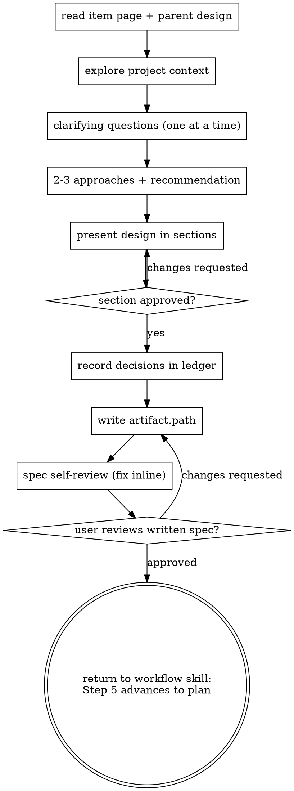

# Designing an Epic

Turn an idea for a decomposition-shaped work item — an `Epic` or a `Release` —
into an approved design artifact its plan stage can decompose from. This skill
owns the **entire** design stage for those two types: whatever discipline it
omits, nothing else supplies.

**Announce at start:** "Using epic-design to design `<work-path>`."

<HARD-GATE>
Do NOT write any code, scaffold anything, file any child work item, or take any
implementation action until you have told your human partner what you intend and
they have approved it. The ceremony scales with the item; the approval gate never
does.
</HARD-GATE>

## Inputs

The dispatch brief supplies `<work-path>` and an absolute `artifact.path`.
Canonical work identity is always the extensionless bundle-relative path the CLI
returns — never derive it from a page stem.

1. Read the item page at `<workspace>/okf/<work-path>.md`.
2. Run `gw work next <work-path> --json` if the dispatch brief lacks current
   routing data.
3. Read any `sources[]` entries the page carries, and the parent item's design
   if this Epic sits beneath one.

`gw` being on PATH doesn't prove it's this repo's build — a stale entry point can
own the name. Verify identity, not presence: `gw util describe-surface --json
>/dev/null 2>&1 || echo "gw is not graph-works-cli — use: uv run --package
graph-works-cli gw …"`.

## Checklist

Create a todo per item and complete them in order.

1. **Explore project context** — files, docs, recent commits, and the code the
   item's `affects` names. Correct the item's own framing out loud if what you
   find contradicts it; an epic filed on a stale inventory decomposes wrong.
2. **Ask clarifying questions** — one at a time, one per message. Prefer
   multiple choice where it fits. Focus on purpose, constraints, success
   criteria, and where the natural seams between children fall.
3. **Propose 2-3 approaches** — with trade-offs and your recommendation. Lead
   with the recommended one and say why. YAGNI ruthlessly.
4. **Present the design in sections** — scale each section to its complexity (a
   few sentences if straightforward, up to 200-300 words if nuanced). Ask after
   each section whether it looks right so far. Cover: goal, approach,
   architecture and its seams, the thin child index, verification, risks, out of
   scope, done criteria.
5. **Record every settled decision in the ledger** (see "Decisions" below).
6. **Write the design artifact** to the brief's `artifact.path` — by default
   `<workspace>/okf/<work-path>/references/01-design.md`.
7. **Spec self-review** — placeholder scan, internal consistency, scope check,
   ambiguity check. Fix inline; no re-review.
8. **User review gate** — ask your human partner to read the written artifact and
   say whether they want changes before the plan stage runs.
9. **STOP.** See "Terminal state" below.

## The epic deltas

These four are why this skill exists rather than a general design skill running
on an Epic. They are not optional.

- **Design the owning item itself, not its children.** The artifact's subject is
  the Epic — its goal, its approach, the seams it decomposes along, and why that
  decomposition and not another. A design that is nine child designs stapled
  together is the shape this skill exists to prevent.
- **Keep the child index thin.** The artifact may carry an index of anticipated
  children, and each row carries only: title, type, summary, `affects`, and the
  dependency rationale (what it needs and why). Nothing more. `planning-epics`
  consumes exactly this at the plan stage.
- **Do not file children and do not pre-write child design artifacts.**
  `planning-epics` files them during the plan stage, records the canonical `path`
  the CLI returns for each, and writes the dependency graph. Filing here would
  produce a pathless draft that has to be adopted later, and it would put each
  child's design somewhere other than its own owned
  `<child-path>/references/01-design.md`.
- **Record settled decisions against the canonical owner path.** Every choice the
  human made during this stage, with its rationale and its blast radius.

## Decisions

Record each settled decision as you settle it, not in a batch at the end:

```bash
gw work decision add <work-path> --question "..." --status answered \
  --answer "..." --rationale "..." --if-wrong "..."
```

Pass your OWN path — the CLI walks up to the owning epic's ledger.

If a question genuinely needs a human and you cannot get one in this session,
file it `open` rather than guessing:

```bash
gw work decision add <work-path> --question "..." --status open \
  --affects <work-path> --if-wrong "..."
```

An `open` decision blocks re-dispatch of the design stage until a human answers
it with `gw work decision answer <work-path> D-nnn --answer "..."`, which is the
intended behaviour: it costs one human touch rather than a burned worker slot
every cycle. Write example ids as `D-nnn`, never with concrete digits — the
cited-decision scan is a bare word-boundary match and cannot tell an example from
a live citation.

## Scope check

If the Epic's scope is genuinely two unrelated efforts, say so before spending
questions on details. The remedy is a second Epic, filed by a human, not a wider
child index.

## Terminal state

This skill never chains into another skill. **Do not invoke `writing-plans`, do
not invoke `planning-epics`, and do not invoke `brainstorming`.** It also never
calls `gw work advance` itself: the `gw:workflow` skill that dispatched
it runs `gw work advance <work-path>` in its own Step 5, uniformly, after every
stage. `planning-epics` is dispatched on the NEXT `gw work next` call, by the
routing table's own `design → plan` transition.

Because that STOP lives in this file, the workflow skill needs no brief rider and
no STOP line for this skill — the same posture `reconciling-spec` takes.

## Process Flow



## Reference

→ `../planning-epics/SKILL.md` — the plan stage that consumes this artifact
→ `../reconciling-spec/SKILL.md` — what runs instead when a spec already exists
→ `../graph-works/references/lifecycle-rules.md`
