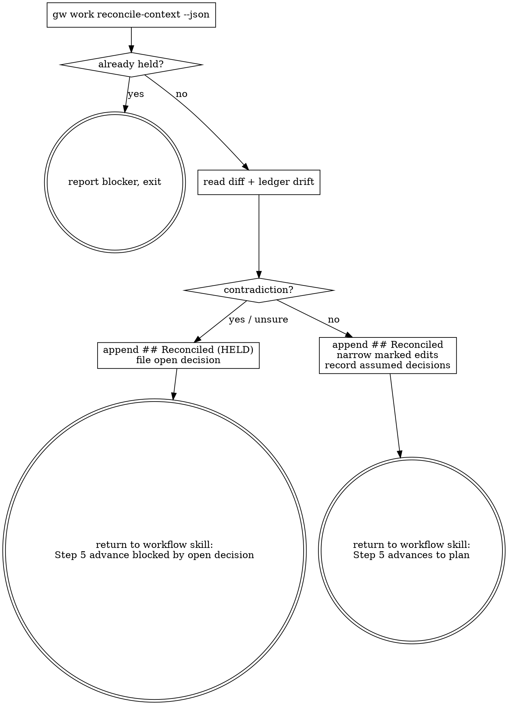

# Reconciling a Spec Against What Landed

A pre-written spec is not stale by default and is not authoritative by default.
This skill decides which, mechanically where it can and by judgment where it
must, and it runs unattended — so the one thing it must never do is advance past
a contradiction it could not resolve.

**Announce at start:** "Using reconciling-spec to update `<slug>`'s spec against what has landed."

## Checklist

1. **Gather the facts — one call, no hand-derivation.**

   ```bash
   gw work reconcile-context <slug> --json
   ```

   Read `spec_path`, `commit_range`, `anchor_source`, `touched_paths`,
   `landed_siblings`, `commits_since`, `cited_decisions`, `contradictions`,
   `has_open_decision`, `diff_command`, `warnings`. Do not re-derive any of it
   by hand — it is mechanical precisely so your judgment goes elsewhere.

   If the `reconcile-context` call itself errors (non-zero exit — an unknown
   slug, a missing workspace), report the error verbatim and stop: do not
   retry and do not fall back to hand-deriving the context. If `diff_command`
   errors when you run it in Step 2, treat that the same as `anchor_source:
   none` below — report it and lean toward holding.

   If `has_open_decision` is already true, stop: a previous pass held this item
   and the answer has not landed. Report the blocker and exit without writing.

   If `anchor_source` is `none`, say so in your report — this pass has no commit
   range, so code drift is unverified and you should lean harder toward holding.

   If `commits_since` is empty and there's no ledger drift, that's not an edge
   case — it's the ordinary-update path with nothing to change: go to 4a,
   write "**Spec updates:** none required this pass," and stop there — the
   workflow skill's Step 5 advances it next.

2. **Read the drift.** Run the `diff_command` the context handed you and read the
   spec at `spec_path`. Two questions, in order:
   - **Ledger drift.** Every id in `contradictions` marks a mechanical,
     unambiguous contradiction: a decision this spec relied on as settled has
     been explicitly reversed. `cited_decisions` entries that moved
     `assumed`/`open` → `answered` are ordinary updates — fold the answer in.
     `status: "missing"` means the spec cites an id the ledger does not have;
     treat it as a note, not a contradiction.
   - **Code drift.** Does the diff change something the spec asserts — a
     signature it quotes, a path it names, an API it assumed a landed sibling
     would expose?

   A code-drift finding is a **contradiction** when it invalidates a premise
   the spec's design rests on — an assumption an architectural choice was
   built on. It is an **ordinary update** when the diff only changes a fact
   the spec quotes or names (a signature, a path, a return type) without
   changing which design was chosen or why. If you can't tell which side a
   piece of drift falls on, that itself is the "uncertain" case below — don't
   strain to force a classification just to avoid holding.

3. **Judge: ordinary update or contradiction?** Hold whenever uncertain. The
   asymmetry is real and it is not close: an ordinary update wrongly held costs
   one human touch, while a contradiction wrongly waved through compounds into
   an epic-wide misunderstanding that surfaces only at execute.

4a. **Ordinary update — reconcile.**
   - Append one `## Reconciled <date> (<short-anchor>..<short-head>)` section at
     the END of the spec. Never rewrite existing prose sections wholesale: a
     spec's job is to preserve the reasoning trail an implementer follows, and a
     rewrite flattens it. Append-only also gives every pass an audit trail for
     free.
   - Make narrow in-place edits only for concrete, mechanically-checkable facts
     the diff shows are now wrong (a quoted signature, a moved path). Each one
     carries an inline `<!-- reconciled <date>: was X -->` marker pointing at
     its `## Reconciled` section.
   - Record anything you had to guess:

     ```bash
     gw work decision add <slug> --question "..." --status assumed \
         --affects <slug> --answer "..." --if-wrong "..." --json
     ```

     Pass your OWN slug — the CLI walks up to the owning epic's ledger.

   Stop here. This skill never calls `gw work advance` itself — the workflow
   skill that dispatched it does that in its own Step 5, uniformly, after
   every stage.

4b. **Contradiction — record and HOLD.**
   - Append the same `## Reconciled` section, with **Result:** reading
     `HELD — see D-nnn (open) in the ledger`, and say in plain language what
     part of the spec the contradiction touches. A human must be able to act on
     it without re-deriving it from the diff.
   - File it as `open`, not `assumed` — `open` means "needs a human", `assumed`
     means "the worker is comfortable proceeding":

     ```bash
     gw work decision add <slug> --question "..." --status open \
         --affects <slug> --if-wrong "..." --json
     ```

   - **Never try to force the advance through.** You don't call `gw work
     advance` here — you never do, in either path of this skill. What keeps a
     hold from silently advancing is not that this skill withholds the call:
     the workflow skill that dispatched you still runs `gw work advance
     <slug>` unconditionally once you return. What actually blocks it is the
     `open` decision you just filed — the routing table's design-stage gate
     refuses to advance an item with an open decision, so that call fails with
     ``open decision(s) block re-dispatch: answer via `gw work decision answer
     <slug> D-nnn --answer ...`, then re-run`` instead of stamping `plan`. The
     item stays at `phase: design` until a human answers it
     (`gw work decision answer <slug> D-nnn --answer ...`), so a hold costs one
     human touch, not a burned worker slot every auto-drive cycle.

## Appended section template

```markdown
## Reconciled <date> (<short-anchor>..<short-head>)

**Landed since this spec was written:**
- [[work/<sibling-slug>]] resolved_in `<sha>` — what it changed, and whether the spec cared.

**Decisions reconciled:**
- D-nnn (assumed → answered): ...

**Spec updates:** none required this pass.
*(or a bullet list, each naming the section touched and pointing at its inline marker)*

**New assumptions recorded:** D-nnn (assumed) — see ledger for detail.

**Result:** advancing to `plan`.
```

**Illustrative-id convention.** Write example ids as `D-nnn`, never with concrete
digits. The cited-decision scan is a bare `\bD-\d+\b` and cannot tell an example
from a live citation, so concrete-looking examples trip the ledger lint rule and
would, worse, make a later pass "reconcile" an id that was never cited. Teaching
the scan to skip fenced blocks was considered and rejected — real specs cite
decisions inside fenced examples, and a false negative there means a superseded
decision silently fails to trigger a hold.

## Process Flow



## Terminal state

This skill never chains into another skill, and it never calls `gw work
advance` itself, in either path. The workflow skill that dispatched it runs
`gw work advance <slug>` unconditionally in its own Step 5: for the
ordinary-update path (4a) that call lands the item at `phase: plan`; for a
hold (4b), the `open` decision just filed makes that same call fail, leaving
the item at `phase: design`. `writing-plans` is dispatched on the NEXT `gw
work next` call, by the routing table's own `design → plan` transition — same
as `brainstorming`. Do not invoke it here.

## Escape hatch

If you judge a wrong assumption expensive enough that guessing is worse than
waiting, escalate instead of recording an `assumed` decision: send one
`orca orchestration ask` (this session's own `--from`/`--dispatch-capability`,
per the dispatch preamble) with the concrete question. `ask` blocks until a
human replies — treat the reply as the answer you would otherwise have
guessed, fold it into the `## Reconciled` section, and continue with 4a as
normal: you are replacing the guess, not skipping any step, and 4a still ends
without calling `gw work advance` itself — the workflow skill's Step 5
advances it, same as any other ordinary-update pass. This is available, not
the default: for a contradiction the default remains filing `open` and
holding.
